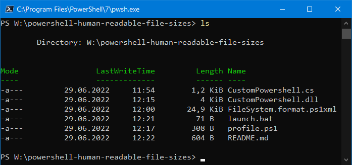

# PowerShell Human Readable File Sizes



## Quick Start

1. Install [Visual Studio](https://visualstudio.microsoft.com/downloads/)
   to get a C# compiler. At a minimum make sure that under "Individual
   Components" the option `C# and Visual Basic Roslyn compilers` is checked.
2. From a Native Tools Command Prompt run
   `csc /target:library CustomPowerShell.cs` to compile the custom format
   function into a loadable dll.
3. `.\launch.bat` to launch a powershell window with the custom profile
   loaded.
4. Run the `Get-ChildItem`.

## Installation

Copy the custom dll and the format description file next to your PowerShell
profile.

```powershell
cp .\CustomPowerShell.dll $HOME\Documents\PowerShell\
cp .\FileSystem.format.ps1xml $HOME\Documents\PowerShell\
```

Edit your PowerShell profile to include the snippet from the `profile.ps1` in
this repository.
